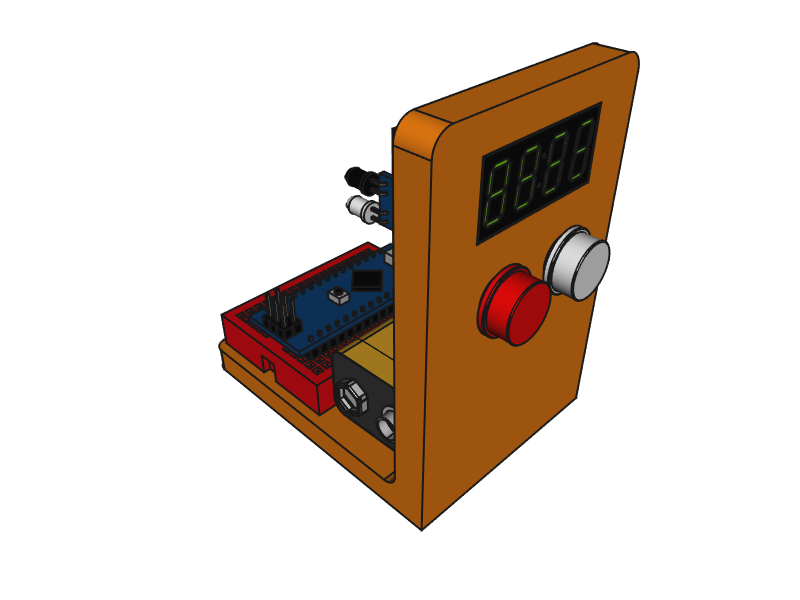

# mBot line follower stopwatch

This is a **simple small and compact stopwatch** created to measure lap times of an [mBot](http://www.makeblock.com/steam-kits/mbot/) arround a line-following circuit.

We needed a **low-cost** way to measure lap times in a automatic, precise and simple way, so the kids could improve their work. This was designed and created with the [EEI's Robot Competition](http://eei.robots.webs.uvigo.es) held at the *Universtiy of Vigo* in mind, where **up to 14 circuits are operated simultaneously!**

## How does it work?

Once the system is turned on, or reset (pushing the red button), it waits until the mBot (or any other thing) passes by the sensor and starts counting (showing it in real time). When the mBot passes again, it records the lap time, showing it for two seconds, but also keeps counting the next lap. Once the mbot performs the preconfigured number of laps (two by default), the system stops counting at all. At this moment, you can push the white button to see the stored lap times (round robin) or the reset button to start all over again.

It uses an **infrared sensor** to detect de mBot passing by and a **4-Digit LED Display** to display the time (current or lap). It's based on an **Arduino Nano** type board, although any other similar board could be used as well. Some **parameters in the stopwatch program** can be configured. Refer to the *[Code](#code)* part to find out which/how.

## 3D
In this folder you can find the [FreeCAD](https://freecadweb.org/) model with all the parts, so you can adjust/modify/adapt the design to your own available parts (or desires). There is also an *[STL file](3D/frame.stl)* of the frame, ready to be sliced and 3D-printed.

## Code
In this folder you can find the code, ready to be used with the [PlatformIO core](http://docs.platformio.org/en/latest/core.html) system: just execute the `platformio run -t upload` command from within the folder (or run the `buildandupload.sh` shell script). It makes use of the [TM1637 library](https://github.com/reeedstudio/libraries/tree/master/DigitalTube) by *Frankie Chue*.

If you want to use it with the [Arduino IDE](https://www.arduino.cc/en/Main/Software#download), just place all the files in the `/src` and `/lib/TM1637` folders together into a folder called `/crono` and then open the `crono.ino` file into de IDE itself: from there on, you can operate as usual with any other *Arduino* program.

In the top part of the `crono.ino` file there are some configurable parameters:
* `CLK`, `DIO`: pins to which the display is connected (2 and 3 by default)
* `IR_PIN`: pin to which the IR sensor is connected (6 by default)
* `KP_PIN`: pin to which the keypad is connected (A4 by default)
* `NUM_LAPS`: number of laps to record/store (2 by default)
* `SHOW_LAP_TIME`: for how long do we show the previous lap time before resuming normal counting (*milliseconds*, 2s by default)
* `CLEAR_WINDOW`: security window during which the sensor is ignored after an initial detection, to prevent *artifacts* (*milliseconds*). Should be aproximately the *size* of the *mBot* passing time (1.5s by default)

## Circuit
In this folder you can find the assembled circuit (done with [Fritzing](http://fritzing.org/)), including the way to mount the switches and the resistors together to get them working with the code. All the connected pins correspond also to the default values in the code itself.

## Electronics
These are the parts I used during the creation of this project. Mentioned here as a reference (no affiliation).

###### by RobotDyn

* 1x 4-Digit LED display, green, clock double-dot, 0.36" 
  https://www.aliexpress.com/store/product/4-Digit-LED-0-36-Display-Tube-clock-doubledot-7-segments-GREEN-TM1637-disp-size-30x14mm/1950989_32797703570.html

* 1x Mini Breadboard 170 pins, 3.5x4.5cm, black 
  https://www.aliexpress.com/store/product/Solderless-Mini-Breadboard-size-3-5x4-5cm-Black-color/1950989_32804715393.html

* 1x Nano ATmega328P MicroUSB V3, compatible Arduino Nano V3 
  https://www.aliexpress.com/store/product/Nano-CH340-ATmega328P-MicroUSB-Compatible-for-Arduino-Nano-V3/1950989_32572612009.html

* 9x Jumper wires 10 cm Male to Female 
  https://www.aliexpress.com/store/product/Jumper-Dupont-wire-4-100mm-Male-to-Female-M-F-3x40L-ribbon-3-ribbons-Totally-120/1950989_32802249806.html

###### by Others
* 1x Infrared Obstacle Sensor 
  https://www.aliexpress.com/wholesale?SearchText=infrared+sensor+obstacle

* 2x B3F-4055 tactile switch with cap 
  https://www.aliexpress.com/wholesale?SearchText=b3f-4055+with+cap

* 2x 10k Ohm resistor 1/4w 
  https://www.aliexpress.com/wholesale?SearchText=10k+resistor

* 1x 9V battery connector 
  https://www.aliexpress.com/wholesale?SearchText=9+volt+battery+connector

* 1x M3 5 mm screw 
  https://www.aliexpress.com/wholesale?SearchText=m3x5+screw

## LICENSE

This work is licensed under a GNU General Public License v3.0: see the [LICENSE](LICENSE) file for details.
